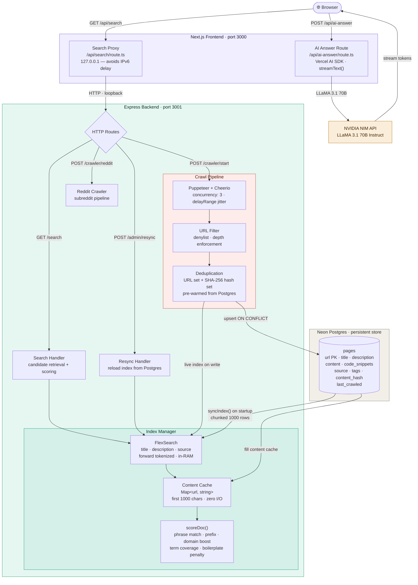

# Trace

> A high-performance, AI-augmented search engine built for developers.

Trace indexes technical documentation, Stack Overflow threads, GitHub repositories, and developer-focused content — surfacing results in under a millisecond with a neural inference layer that synthesizes answers from the top results in real time.


---

## Architecture



The frontend never touches the database directly. All search traffic flows through the Express backend, which owns the in-memory index and the crawl pipeline exclusively. The AI answer route in Next.js is the sole consumer of the NVIDIA NIM API and streams its response directly to the browser via the Vercel AI SDK.

---

## Stack

| Layer | Technology |
|---|---|
| Frontend | Next.js 15, TypeScript, Framer Motion, Tailwind CSS |
| Backend | Express, Node.js 20 |
| Search | FlexSearch (in-memory inverted index) |
| Crawler | Puppeteer, Cheerio |
| Database | Neon Postgres (serverless) |
| AI model | LLaMA 3.1 70B Instruct via NVIDIA NIM |
| AI SDK | Vercel AI SDK (streaming) |

---

## Performance

| Operation | Typical latency |
|---|---|
| FlexSearch candidate retrieval | < 1 ms |
| Content cache resolution (`Map.get`) | < 0.1 ms |
| Multi-signal scoring (40 candidates) | 1–3 ms |
| Full search pipeline end-to-end | 2–5 ms |
| Next.js → Express round-trip | 8–20 ms |
| Browser fetch → first result render | 20–40 ms |
| AI first token appearance | 300–600 ms |

The dominant cost in browser-perceived latency is the HTTP round-trip over loopback, not the search computation itself.

---

## System Components

### Crawl pipeline — `server/src/crawler.ts`

A concurrent, Puppeteer-driven spider handling the full lifecycle from URL discovery to database persistence.

- **Deduplication** — pre-warms URL and SHA-256 content-hash sets from Postgres before each crawl; skips pages whose content hasn't changed.
- **Resource filtering** — aborts images, fonts, stylesheets, media, and websocket requests at the network layer via Puppeteer's request interception, reducing per-page bandwidth by ~80%.
- **Content extraction** — Cheerio parses `title`, `description`, `content` (all `<p>`, `<article>`, `<section>`, `<li>`, `<pre>`), `codeSnippets` (all `<code>` and `<pre>`, capped at 10 000 chars), `source`, and `tags`.
- **Live indexing** — upon a successful Postgres write, the page is immediately pushed into the FlexSearch index and content cache, making it searchable without a server restart.
- **Concurrency** — configurable `maxConcurrency` (default: 3) and randomized `delayRange` inter-request pauses. A FIFO queue of `{ url, depth }` tuples enforces strict depth limits.
- **URL filtering** — a denylist strips auth pages, pagination, tag archives, sitemaps, and other low-signal routes before they enter the queue.

### Index manager — `server/src/index-manager.ts`

The performance-critical core. Every search query resolves entirely in memory.

- **FlexSearch Document index** — three indexed fields: `title` (forward tokenized), `description` (forward tokenized), `source` (strict tokenized). The `content` field is intentionally excluded to keep the RAM footprint minimal.
- **Content cache** — a module-level `Map<string, string>` stores the first 1 000 characters of each page's body. Serves the relevance scorer and the result snippet with zero I/O.
- **Index sync** — `syncIndex()` is called once on startup, loading the full `pages` table from Postgres in chunks of 1 000 rows. A resync takes 10–15 s for 50 000 pages and requires no further database reads for the lifetime of the process.
- **Search pipeline** — five stages:
  1. Candidate retrieval from FlexSearch (`enrich: true`, `suggest: true`, pool of 40).
  2. Cross-field deduplication into a `Map<url, doc>`.
  3. Content resolution from the in-memory cache (`Map.get` — no I/O).
  4. Multi-signal scoring via `scoreDoc()`: exact phrase match, prefix position, per-term occurrence counts, query coverage ratios, domain authority boost (+50 for MDN, TypeScript, React, Node.js, Rust, Docker, Kubernetes, Tailwind, and others), and boilerplate title penalty.
  5. Sort descending by score, return top 10.

### Express backend — `server/src/index.ts`

| Method | Path | Purpose |
|---|---|---|
| `GET` | `/search?q=` | Execute a search query against the in-memory index |
| `POST` | `/crawler/start` | Start a background Puppeteer crawl from a seed URL |
| `POST` | `/crawler/reddit` | Start a Reddit-specific crawl across given subreddits |
| `POST` | `/admin/resync` | Re-synchronize the FlexSearch index from Postgres |

`syncIndex()` is awaited before the process accepts any requests, guaranteeing a fully populated index on first query.

### Next.js API routes — `src/app/api/`

**Search proxy** (`/api/search/route.ts`) — relays the `q` parameter to `http://127.0.0.1:3001/search`. Uses `127.0.0.1` explicitly to avoid the Node.js IPv6 resolution delay (300–500 ms on Windows and some Linux configurations).

**AI answer route** (`/api/ai-answer/route.ts`) — accepts the user's query and top four search results, builds a structured system prompt with title, description, URL, and code snippets from each result, and streams a synthesized answer from LLaMA 3.1 70B via the Vercel AI SDK's `streamText()`.

### Frontend — `src/app/page.tsx`

Built with Next.js 15, Framer Motion, and Tailwind CSS.

- **Search-as-you-type** — 400 ms debounce fires a fetch to `/api/search`; results populate without pressing Enter.
- **Layout morphing** — the search input and logo carry Framer Motion `layoutId` attributes and smoothly morph to the top navigation bar when results mode activates. Spring physics use a `[0.22, 1, 0.36, 1]` cubic bezier at 850 ms.
- **AI terminal** — becomes visible as soon as the user starts typing. Before triggering: displays a keyboard hint. After Enter: streams markdown rendered by `react-markdown` through a pulsing "Synthesizing context…" state.

---

## Data Store

**Neon Postgres** — single `pages` table:

| Column | Type | Notes |
|---|---|---|
| `url` | `text` PK | Normalized, deduplicated |
| `title` | `text` | From `<title>` or first heading |
| `description` | `text` | From `<meta name="description">` |
| `content` | `text` | Extracted body text |
| `code_snippets` | `text` | All `<code>` and `<pre>` content |
| `source` | `text` | Crawl batch label |
| `tags` | `text` | Comma-separated keywords |
| `content_hash` | `text` | SHA-256 of content for dedup |
| `last_crawled` | `timestamptz` | Crawl timestamp |

Upserts use `ON CONFLICT (url) DO UPDATE SET` to keep records fresh on recrawl.

---

## Local Development

**Prerequisites** — Node.js 20+, a Neon Postgres database with the `pages` table created, an NVIDIA NIM API key.

**Environment** — create a `.env` file in the project root:

```env
DATABASE_URL=postgresql://...
NVIDIA_KEY=nvapi-...
```

**Start the backend:**

```bash
cd server
npm install
npm run dev
```

The server starts on port 3001, syncs the full index from Postgres, and is ready to handle search queries.

**Start the frontend:**

```bash
cd src
npm install
npm run dev
```

The Next.js dev server starts on port 3000.

**Run a crawl:**

```bash
curl -X POST http://localhost:3001/crawler/start \
  -H "Content-Type: application/json" \
  -d '{"seedUrl": "https://nextjs.org/docs"}'
```

Pages are indexed live and become searchable within seconds of being crawled.

**Re-sync the index:**

```bash
curl -X POST http://localhost:3001/admin/resync
```

---

## Project Structure

```
SearchEngine/
├── server/                        Express backend
│   ├── src/
│   │   ├── index.ts               Server entry point, HTTP routes
│   │   ├── crawler.ts             Puppeteer crawl engine
│   │   ├── index-manager.ts       FlexSearch index, content cache, relevance scorer
│   │   ├── storage.ts             Neon Postgres query layer
│   │   ├── db.ts                  Database connection pool
│   │   └── reddit-crawler.ts      Reddit-specific crawl pipeline
│   └── scripts/
│       ├── mega-crawl.ts          Seeded multi-domain crawl runner
│       ├── verify-index.ts        Index correctness diagnostics
│       └── check-count.ts         Database row count utility
└── src/                           Next.js frontend
    ├── app/
    │   ├── page.tsx               Main search UI
    │   ├── globals.css            Theme, scrollbars, animations
    │   └── api/
    │       ├── search/route.ts    Search proxy to Express
    │       └── ai-answer/route.ts NVIDIA NIM streaming endpoint
    └── components/
        └── ui/
            ├── text-animate.tsx   Framer Motion character animation
            ├── terminal.tsx       Styled terminal output component
            ├── shimmer-button.tsx Animated submit button
            └── meteors.tsx        Background particle effect
```

---

## Design Decisions

**Why a separate Express backend?** Next.js API routes are stateless by design — unsuitable for hosting an in-memory search index. The Express backend is a persistent Node.js process that holds the FlexSearch index in RAM for the lifetime of the server.

**Why FlexSearch over a vector database?** For developer documentation search, keyword and phrase relevance is more precise than cosine similarity over embeddings. A user searching for `useEffect cleanup` wants documents containing those exact tokens, not semantically adjacent results. FlexSearch delivers sub-millisecond full-text search with forward tokenization at negligible memory cost.

**Why not index `content` in FlexSearch?** A forward-tokenized inverted index on the content field generates hundreds of index positions per document. At 10 000 documents with ~2 000 characters each, the content index alone would consume several hundred megabytes and slow each insertion. The scorer instead reads content from the in-memory cache — cheaper than indexed lookup for this use case.

**Why SHA-256 for deduplication?** Content-addressed deduplication catches pages that changed their URL (redirects, canonicalization) but not their body, and guards against re-crawling mirror sites. The hash is computed server-side before any database write and checked against a pre-warmed in-memory set — zero round-trips.

---

*Built by a developer, for developers.*
